<h1 align="center">基于Spring Boot 的智慧校园管理系统【带论文】</h1>

- <b>完整代码获取地址：从戎源码网 ([https://armycodes.com/](https://armycodes.com/))</b>
- <b>技术探讨、资料分享，请加QQ群：692619798</b>
- <b>作者微信：19941326836  QQ：3645296857</b>
- <b>承接计算机毕业设计、Java毕业设计、Python毕业设计、深度学习、机器学习</b>
- <b>选题+开题报告+任务书+程序定制+安装调试+论文+答辩ppt 一条龙服务</b>
- <b>所有选题地址 ([https://github.com/Descartes007/allProject](https://github.com/Descartes007/allProject)) </b>

## 一、项目介绍

### 基于 Spring Boot 的智慧校园管理系统，系统角色包括管理员、老师、用户（学生）：
### 管理员（系统/超级管理员）
- 基本操作：登录、修改密码、获取/修改个人信息
- 用户管理：用户增删改查、账号唯一性校验
- 宿舍管理：宿舍列表/详情、新增/修改/删除、宿舍人员管理
- 宿舍归寝与宿舍人员：归寝记录查看、宿舍人员信息管理
- 报修管理：发布报修、报修列表/筛选/删除、查看报修详情、确认维修
- 成绩管理：成绩列表/详情/新增/修改/删除
### 课程与教师管理：课程管理、教师信息管理、课程留言与课程收藏
- 记事本/备忘录：记事本增删改查、备忘录类型管理
- 音乐与多媒体资源：音乐列表/详情、音乐收藏、音乐留言
- 计算机相关软件资源：资源列表/收藏/留言管理
### 老师
- 基本操作：登录、修改密码、获取/修改个人信息
### 与教师相关的数据查看与管理：只查看/管理与自身关联的课程、成绩、学生/宿舍信息（后端通过 session role 进行过滤）
- 报修与维修确认、留言查看与回复等交互功能
### 用户（学生/普通用户）
- 基本操作：登录、修改密码、获取/修改个人信息、注册
- 面向用户的资源：查看宿舍信息、报修提交、查看成绩、查看/收藏/留言于音乐、课程与软件资源、记事本等

## 二、项目技术

- 编程语言：Java
- 前端技术：Vue、Vue Router、Vuex、Axios、Element UI（组件库）、Webpack/Vue-CLI（构建）
- 后端技术：Spring Boot、MyBatis / MyBatis-Plus、、Maven（构建）、MySQL、FastJSON、Commons-IO、Hutool 等

## 三、运行环境

- JDK版本：1.8及以上都可以
- 操作系统：Windows7/10、MacOS
- 开发工具：IDEA、Ecplise、MyEclipse都可以

## 四、数据库配置文件

- npm版本：6.14.13及以上都可以
- Redis版本：3.2.100及以上都可以
- 文件名：application.yml
- 编码类型：utf8

## 论文截图

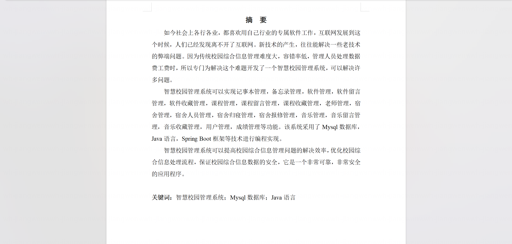

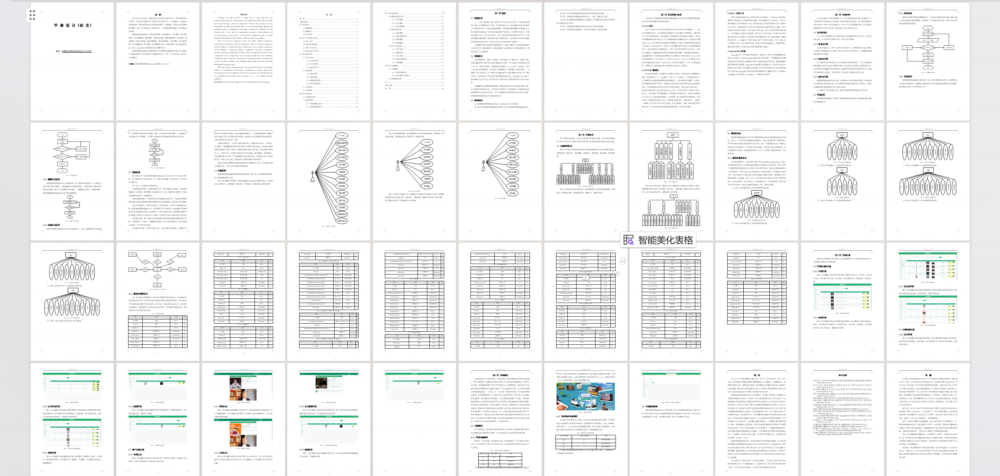

## 系统截图

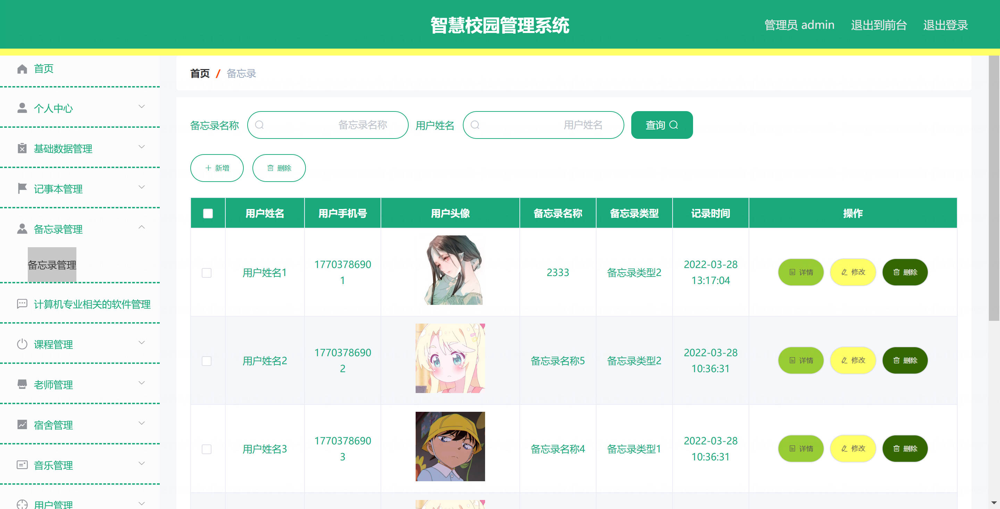

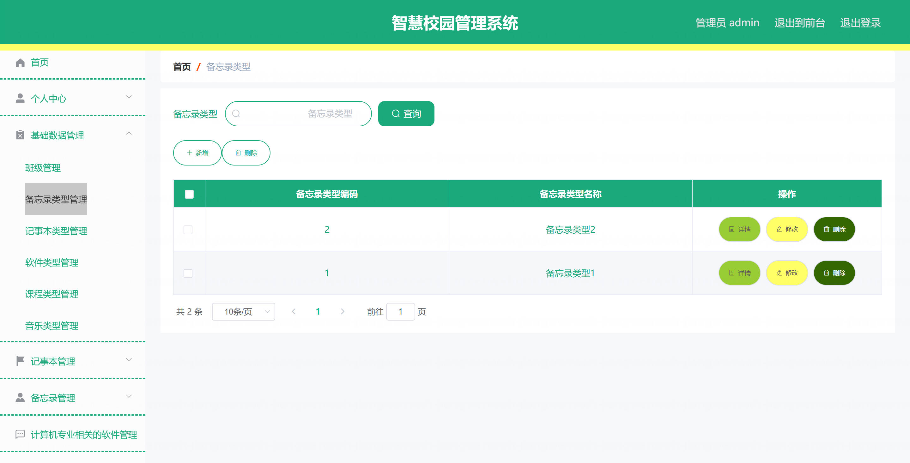

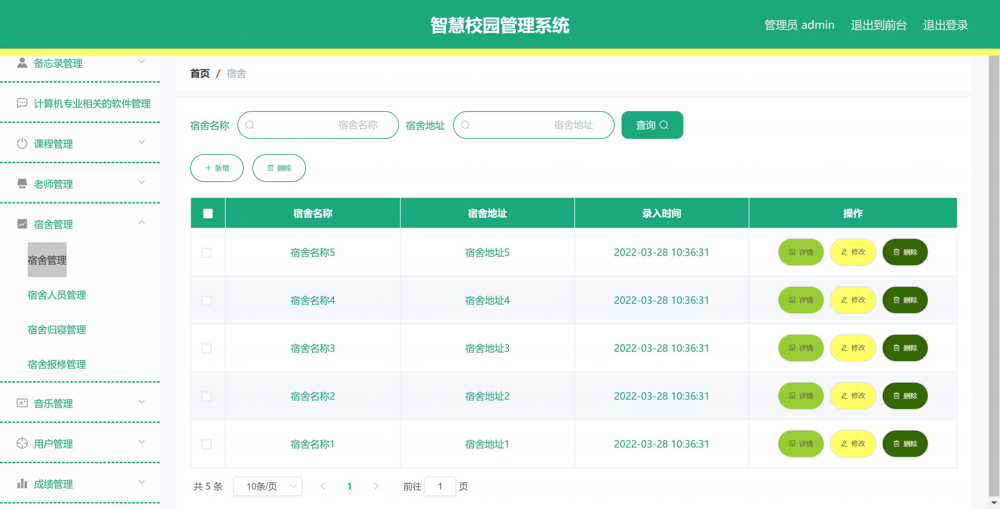

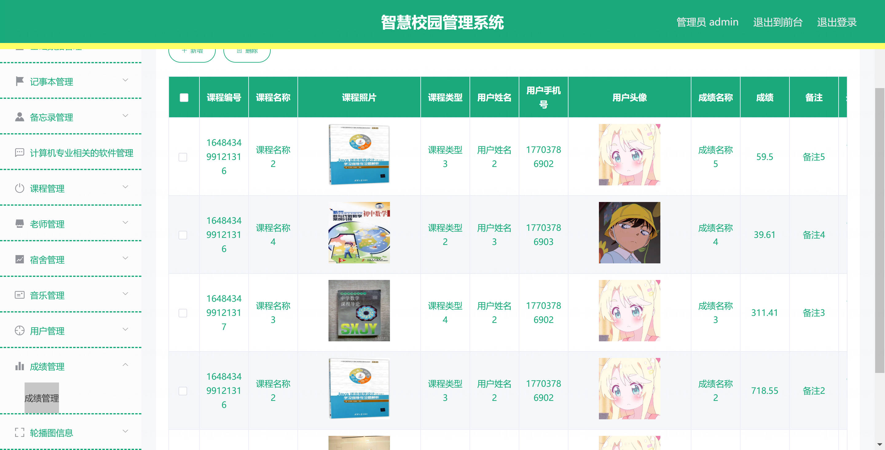

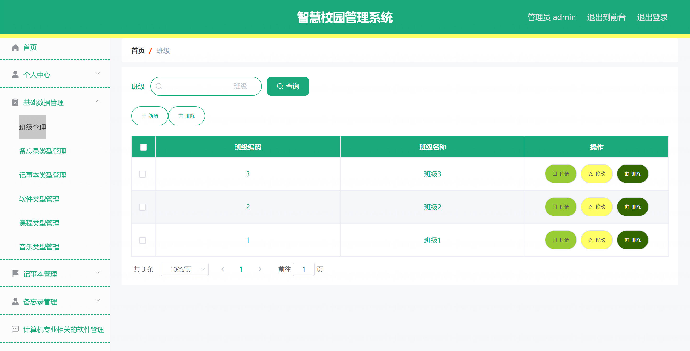

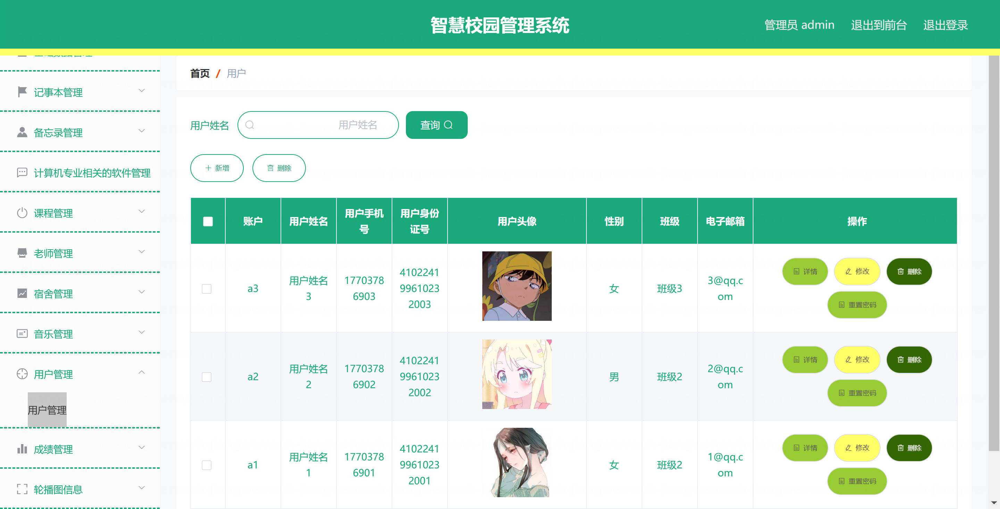

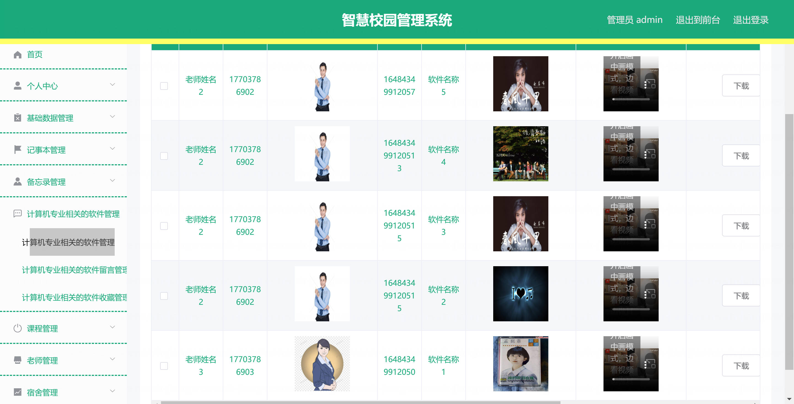

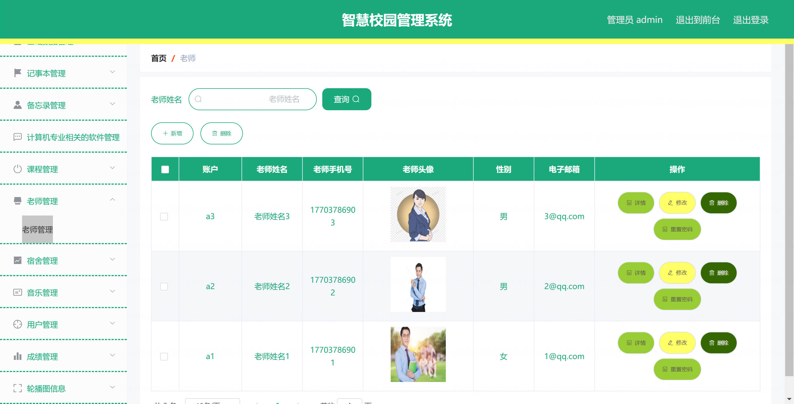

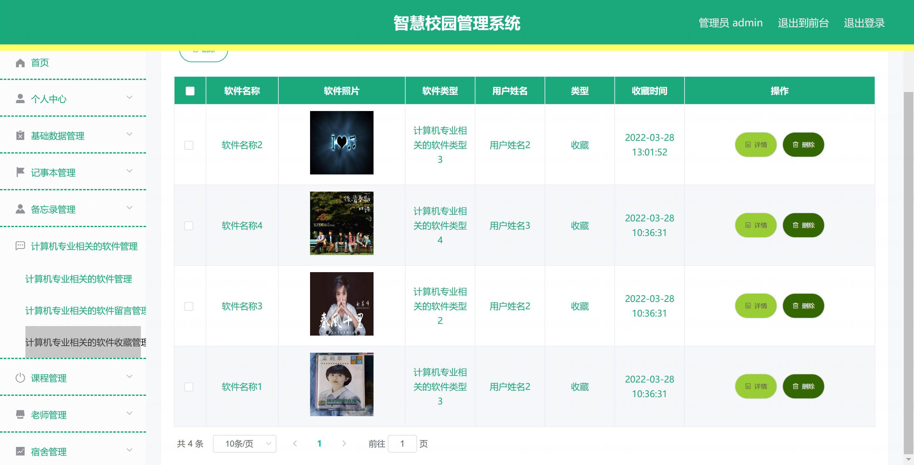